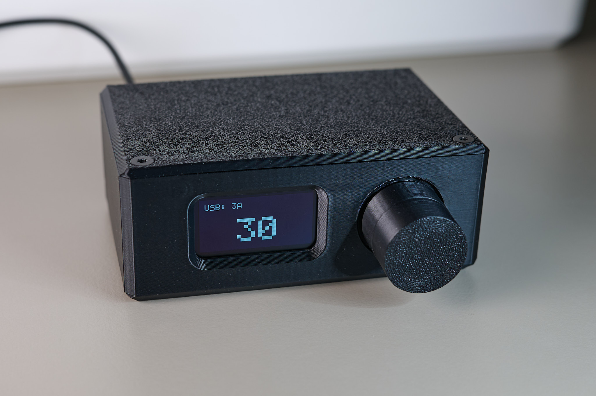
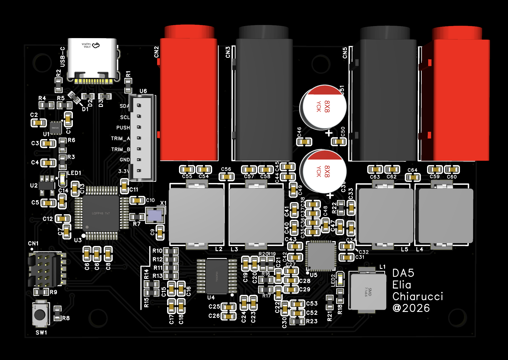

# DA15 - USB Audio DAC + Amplifier

Firmware for the DA15 USB-C DAC/AMP.
- **MCU**: STM32F072
- **DAC**: PCM5101A
- **AMP**: PAM8965
- **Single USB-C cable**: for power and 24-bit/48kHz stereo audio (USB Audio Class 1).




For more pictures, see [Hardware/Images](Hardware/Images/).


## Features

- **USB Audio Class 1** - 24-bit/48kHz stereo, driverless
- **2-band EQ** - bass and treble, custom Q12 fixed-point processing
- **USB-C power detection** - adapts output level based on CC line voltage (500mA / 1.5A / 3A)
- **OLED UI** - SH1106 128x64 display with rotary encoder navigation
- **DFU firmware update** - update over USB from the settings menu
- **Persistent user settings** - stored in flash with wear leveling

## Building

**Requirements:** CMake 3.22+, Ninja, ARM GCC toolchain

The [STM32 VS Code Extension](https://marketplace.visualstudio.com/items?itemName=stmicroelectronics.stm32-vscode-extension) is recommended for development.

```bash
cmake --preset Release # Debug won't work for audio playback as it's not optimised and the STM32F0 is not very powerful. 
cmake --build build/Release
```

Or clicking the "Build" button on the bottom of VSCode.

## Debugging

There are 2 debugging profiles (in the Run and Debug tab):
**STM32Cube: STM32 Launch ST-Link GDB Server**
This is the profile created by the STM32 Extension, it will use ST-Link to flash the board.

**Debug with OpenOCD**
This profile will use OpenOCD to flash the board, and will also spawn an RTT terminal with logging directly in VSCode.


## Flashing

**With ST-Link:**
```bash
openocd -f interface/stlink.cfg -f target/stm32f0x.cfg \
  -c "program build/Release/DA15.elf verify reset exit"
```

**Over USB (DFU):**
Enter DFU mode from the device menu or run `dfu-util --detach`, then:
```bash
dfu-util -a 0 -s 0x08000000:leave -D build/Release/DA15.bin
```

STM32CubeProgrammer in USB DFU can also be used.


## Project Structure

```
App/           Application firmware
├── Inc/       Headers
└── Src/       Implementation (audio pipeline, EQ, display, USB, settings)
Core/          STM32CubeMX generated HAL init code
Drivers/       STM32F0xx HAL library
Lib/           TinyUSB (USB stack), SEGGER RTT (debug)
```

## Dependencies

| Library | License | Purpose |
|---------|---------|---------|
| [TinyUSB](https://github.com/hathach/tinyusb) | MIT | USB Audio Class 1 stack |
| [STM32F0 HAL](https://github.com/STMicroelectronics/stm32f0xx_hal_driver) | BSD-3-Clause | Hardware abstraction |
| [SEGGER RTT](https://www.segger.com/products/debug-probes/j-link/technology/about-real-time-transfer/) | BSD-1-Clause | Debug output (optional) |

## Licenses

The software of this project is licensed under the [GPL-3.0-only](LICENSE).

All the hardware files are licensed under the [CERN-OHL-S-2.0](Hardware/LICENSE).

